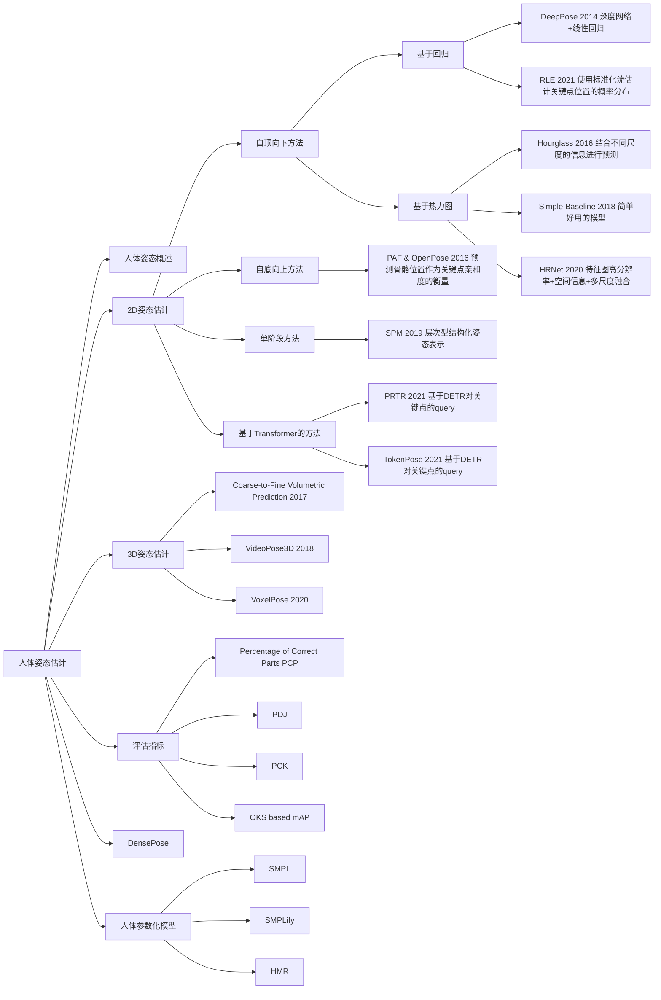

# 人体姿态估计 (Human Pose Estimation)

## 人体姿态概述

### 什么是人体姿态估计
从给定的图像中识别人脸、手部、身体等关键点。[^1]

**输入**：图像  
**输出**：所有关键点的像素坐标 (x1,y1),(x2,y2)...(xJ,yJ), 这 J 为关键点的总数，取决于具体的关键点模型。

例如人脸68关键点，手势21关键点，人体18关键点。这是一个很难的模式识别问题，要去追踪这些不断变化的点。

### 3D姿态估计
预测人体关键点在三维空间中的坐标，可以在三维空间中还原人体的姿态。

### 人体参数化模型
更进一步，可以从图像或者视频中恢复出运动的3D人体模型。

### 下游任务
1. **行为识别**。PoseC3D：基于人体姿态识别行为动作，比如拥抱。
2. **CG、动画**。通过识别表情姿态，去驱动动画，同步行为。
3. **人机交互**。例如通过手势识别，去控制物体动作。
4. **动物行为分析**。

## 2D姿态估计
2D人体姿态估计就是在图像上定位人体关键点（通常为人体主要关节）的坐标。

解决这个问题的基本思路有以下 2 种：
1. **基于回归(RegressionBased)**
将关键点检测问题建模成一个回归问题，让模型直接回归关键点的坐标，即 (x1,y1,...,xJ,yJ) = f&#920;(I)。
**分析**：深度模型直接回归坐标有些困难，精度不是最优。

2. **基于热力图(Heatmap Based)**
这种方法不直接回归关键点的坐标，而是预测关键点位于每个位置的概率，即H1...J = f&#920;(I)。
H(xj,yj)= 1 表示关键点 j 位于 (xj,yj) 的概率为1，H 称为热力图，尺寸与原图 I 相同或按比例缩小.
   - 热力图可以基于原始关键点坐标生成，作为训练网络的监督信息
   - 网络预测的热力图也可以通过求极大值等方法得到关键点的坐标  

    **分析**：模型预测热力图比直接回归坐标相对容易，模型精度相对更高，因此主流算法更多基于热力图，但预测热力图的计算消耗大于直接回归。

### 自顶向下方法

#### 基于回归的自顶向下方法

##### DeepPose 2014 [^2]

DeepPose 是姿态估计领域的里程碑论文，相当于 AlexNet 之于 Computer Vision，标志着一个领域由传统算法向深度学习算法转变。[^3]

以分类网络为基础，将最后一层分类改为回归，一次性预测所有 J 个关键点的坐标

$${\widehat{P}}=\left(x_{1},y_{1},x_{2},y_{2},\ldots,x_{J},y_{J}\right)=f_{\Theta}(X)$$

通过最小化平方误差训练网络

$$\mathop{min}\limits_{\Theta}\sum_{(X,Y)\in D}\left\|{\widehat{P}}-P\right\|_{2}^{2}$$

通过级联提升精度
- 第一级 以全身图像为输入，预测所有关键点坐标，位置精度较低
- 第二级 以每个预测点为中心，裁剪局部图像送入第二级网络，再次回归该点坐标，提升精度
- 可级联多级

回归方法的优势与劣势

**优势**
- 回归模型理论上可以达到无限精度，热力图方法的精度受限于特征图的空间分辨率
- 回归模型不需要维持高分辨率特征图，计算层面更高效，相比之下，热力图方法需要计算和存诸高分辨率的热力图和特征图，计算成本更高

**劣势**
- 图像到关键点坐标的映射高度非线性，导致回归坐标比回归热力图更难，回归方法的精度也弱于热力图方法，因此DeepPose提出之后的很长一段时间内，2D关键点预测算法主要基于热力图

##### Residual Log-likelihood Estimation (RLE) 2021[^4]
**核心思路**：对关键点的位置进行更准确的概率建模，从而提高位置预测的精度

**经典回归范式**
模型预测关键点位置 $\hat{\mu}$，与真值 $\mu_g$。计算误差作为损失，背后隐含了高斯分布的假设，但不一定符合数据的实际分布
**RLE的范式**
显示建模关键点的概率分布 $P_{\Theta}(x|I)$，通过最大似然拟合最优的位置分布

#### 基于热力图的自顶向下方法
##### Hourglass 2016[^5]
Hourglass 是姿态估计领域标志性工作。

**设计思路**：准确的姿态估计需要结合不同尺度的信息：
- 局部信息 --> 检测不同身体组件
- 全局信息 --> 建模组件之间的关系，在大尺度变形、遮挡时也可以准确推断出姿态

##### Simple Baseline 2018[^6]
力求结构简单，使用ResNet配合反卷积形成编码器-解码器结构。

##### HRNet 2020[^7]
**核心思路**：在下采样时通过保留原分辨率分支来保持网络全过程特征图的高分辨率与空间位置信息，并设计了独特的网络结构实现不同分辨率的多尺度特征融合。

### 自底向上方法

##### Part Affinity Fields & OpenPose 2016[^8]
**核心思路**：基于图像同时预测关节位置和四肢走向，利用肢体走向辅助关键点的聚类。如果某两个关键点由某段肢体相连，则这两个关键点属于同一人。

### 单阶段方法

##### SPM 2019[^9]
单阶段解决方案是由 SPM 提出的，在取得速度优势的同时，也取得了不逊色于二阶段方法的检测率。并该方法可以直接从2D图像扩展到3D图像的人体姿态估计。

为了统一人体实例和身体关节的位置信息，为多人姿势估计提供单阶段解决方案，SPR引入了一个辅助关节，即根关节以表示人员实例位置，它是唯一标识关节。

但是SPR存在明显弊端，例如由于可能存在较大的姿势变
形，可能涉及身体关节和根关节之间的远距离位移，这给
从图像表示映射到失量域的位移估计带来困难。

因此在SPR的基础上提出了HierarchicalSPR，根据自由度和变形程度将根关节和身体关节划分为四个层次：
- 第一级为根关节
- 第二级包含颈、肩、臀
- 第三级包含头、肘、膝
- 第四级包含手腕、脚踝

### 基于Transformer的方法
##### PRTR 2021[^10]

人体姿态估计和物体检测有一定相似性，都涉及对图像内容的定位。
在 DETR 中 query 通过注意力机制逐渐聚焦到特定物体上。
姿态估计可模仿 DETR，让 query 逐渐聚焦到特定人体关键点上。

###### PRTR 两阶段算法
- **人体检测阶段**：使用DETR检测出图中的不同的人
- **关键点检测阶段**：同样使用DETR结构，不同的是 query 学习关键点信息，最终回归关键点位置

###### PRTR 单阶段算法
人物检测和关键点检测共用一个图像特征网络。
设计了 Spatial Transformer Network(STN) 模块，从完整特征图中裁剪出单人对应的图像特征，用于后续关键点检测。

##### TokenPose 2021[^11]
将视觉 token 和关键点 token 一起送入 encoder 可以同时从图像中学习外观视觉表现和关键点间的约束关系
分类模型 ViT 也使用类似方法，将一个分类 token 和 visual token 一起做自注意力。

## 3D姿态估计

**任务描述**
通过给定的图像预测人体关键点在三维空间中的坐标，可以在三维空间中还原人体的姿态。  
**输入**: 图像 $I\in\mathbb{R}^{H\times W\times3}$  
**输出**：所有人的所有关键点的空间坐标 $\left\\{\left(x_{j}^{i},y_{j}^{i},z_{j}^{i}\right)\right\\}_{j=1\ldots J}^{i=1\ldots N}$，这里 *N* 为图中总人数，*J* 为关键点总数

**难点**
3D人体姿态估计要求从2D图像（或视频）恢复3D信息
问题：3D信息从何而来？

**思路1：直接预测**
直接基于从 2D 图像回归 3D 坐标，但 2D 图像不包含深度，这是一个病态问题。
实际上隐式借助了语义特征或人体的刚性实现了 3D 姿态的推理。

**思路2：利用视频信息**
既然3D预测需要借助更多的信息，就可以运用视频来获得更多的帧间信息辅助推断

**思路3：利用多视角图像**
直接运用同一对象的多视角拍摄的图片来预测和还原出3D信息

##### Coarse-to-Fine Volumetric Prediction 2017 [^12]
**核心思路**：单张图像输入卷积网络，预测3D热力图

模型为 Hourglass 级联，每级直接预测关键点的 3D 热力图
对于每个关节点，预测目标为 64 x 64 x *d* 的 3D 热力图，*d* 的取值，即深度方向的分辨率，逐级增加。每级取值为 {1,2,4,8,16,32,64}

**有趣的发现**：直接用2D座标预测3D座标就可以取得比较好的效果，不需要借助图像

##### VideoPose3D 2018[^13]

**核心思路**：基于单顿图像预测 2D 关键点，再基于多帧 2D 关键点结果预测 3D 关键点位置

##### VoxelPose 2020[^14],[^15]
**核心思路**：利用多视角图像，使用 HRNet 产生不同视角的特征图，根据相机参数，将图像特征整合到一个特整体中，再使用 3D 卷积网络产生检测每个人的位置。对于每个人，构建一个空间分辨率更高的 3D 特征体，使用 3D 卷积网络给出该人所有关键点的空间座标。

## 评估指标 [^16]

##### 1. Percentage of Correct Parts (PCP)

PCP 以肢体的检出率作为评价指标

$$PCP = \frac{\text{整个数据集中正确检出的此部位数}}{\text{整个数据集中此部位总数}}$$

##### 2. Percentage of Detected Joints (PDJ)
PDJ 以关节点的位置精度作为评价指标

##### 3. Percentage of Correct Key-points (PCK)
PCK 以关键点的检测精度作为评价指标

##### 4. Object Keypoint Similarity (OKS) based mAP
OKS based mAP 以关键点相似度(OKS)作为评价指标计算mAP，OKS 是 MS COCO 竞赛指定的关键点评价指标，其定义为

$$\frac{  
       \begin{array}{c l}{{\sum_{i}\exp\big(-d_{i}^{2}/2s^{2}k_{i}^{2}\big)\delta\big(v_{i}\gt 0\big)}}  
       \end{array} 
    }{
     {      
        \begin{array}{c l}{{\sum_{i}\delta\left(v_{i}\gt 0\right)}} 
        \end{array}
     } 
}$$

其中：
- $d_{i}$，是 gt 和预测关键点之间的欧氏距离
- $s$ 是对象分割区域面积的平方根
- $k$ 是控制衰减的关键点常量
- $v$ 是一个可见性标志，可以是0、1或2，分别表示未标记、标记但不可见、可见并标记
- 由于 OKS 可以用于计算距离（0-1之间），所以它可以显示预测关键点与真实关键点之间的距离

## DensePose

将人体表面分为24个部分，并将每个部分参数化至同样大小(256x256)的UV平面。
标注各身体部分的区域后，在每个部分等距采样至多14个点，并对应到3D人体上，用以训练。

**网络结构**: Mask-RCNN + DenseReg = DensePose-RCNN
先进行前景与背景的预测，再进行人体每一部分的精确回归。

**改进设计**
与辅助任务(关键点、Mask)的交叉级联。
训练TeacherNetwork，实现基于蒸馏的ground truth插值，从而产生更加密集的监督信号。

#### 身体表面网格（Body Mesh）
身体表面网格是由多边形（通常为三角形或四边形）网格组成构建的人体表面模型，通常由具有3D位置坐标的顶点（Vertices）来定义。

#### 混合蒙皮技术(Blend Skinning)
混合蒙皮技术是一种使身体表面网格(Body mesh)随内在的骨骼结构形变的方法。当骨骼结构发生变化时，特定关节点Joint）的位置变化对人体表面不同顶点Vertex）的位置变化有不同影响，在混合蒙皮技术里，这种影响是由不同的权重实现的。

两种较常见的混合蒙皮技术：
LBS（LinearBlendSkinning)：线性混合蒙皮
DQBS(Dual-QuaternionsBlendSkinning)：双四元数混合蒙皮

#### 线性混合蒙皮LBS(Linear Blend Skinning)
将顶点随骨骼变化的关系建模成以下线性关系
$$v_{j}^{\prime}=\sum_{i}w_{i j}T_{i}v_{j}^{i}$$

其中：
- $i$ ：骨骼序号
- $j$ ：顶点序号
- $v_{j}^{i}$：形变前第j个顶点相对于第i个骨骼的坐标
- $v_{j}^{\prime}$：形变后顶点坐标
- $T_{i}$：骨骼在空间变换矩阵
- $w_{i j}$：第i个骨骼对第j个顶点的权重影响

## 人体参数化模型
### SMPL人体参数化模型
SMPL是针对构建人体参数化模型，将人体建模成以N=6890个顶点（Vertices）与K=23个关节点(Joints）为基础的身体表面网格（Mesh)。
并设计了形态参数β与姿态参数θ来控制人体的变化。

### SMPLify
人体参数化模型估计的早期方法，基于 SMPL 模型，可以从单张图像估计出人体的 3D mesh。

### HMR
基于深度学习模型，从图像直接估计 SMPL 模型参数，从而重建人体表面网格。
该模型可在只有 2D 标注的情况下进行训练。

# 参考资料
[^1]:<a id="mmpose">[人体关键点检测与MMPose](https://www.bilibili.com/video/BV1kk4y1L7Xb/?spm_id_from=333.999.0.0&vd_source=86f975c2afd68dc55284d0ebca36382b)</a> 

[^2]:<a id="DeepPose">[*DeepPose: Human Pose Estimation via Deep Neural Networks*](https://arxiv.org/abs/1312.4659)</a> 

[^3]:<a id="DeepPose2">[DeepPose全面解析（原理+代码+Colab）](https://zhuanlan.zhihu.com/p/424166966)</a> 

[^4]:[*Human Pose Regression with Residual Log-likelihood Estimation*](https://arxiv.org/abs/2107.11291)

[^5]:[*Stacked Hourglass Networks for Human Pose Estimation*](https://arxiv.org/abs/1603.06937)

[^6]:[*Simple Baselines for Human Pose Estimation and Tracking*](https://arxiv.org/abs/1804.06208)

[^7]:[*Deep High-Resolution Representation Learning for Visual Recognition*](https://arxiv.org/abs/1908.07919)

[^8]:[*OpenPose: Realtime Multi-Person 2D Pose Estimation using Part Affinity Fields*](https://arxiv.org/abs/1812.08008)

[^9]:[*Single-Stage Multi-Person Pose Machines*](https://arxiv.org/abs/1908.09220)

[^10]:[*Pose Recognition with Cascade Transformers*](https://arxiv.org/abs/2104.06976)

[^11]:[*TokenPose: Learning Keypoint Tokens for Human Pose Estimation*](https://arxiv.org/abs/2104.03516)

[^12]:[*Coarse-to-Fine Volumetric Prediction for Single-Image 3D Human Pose*](https://arxiv.org/abs/1611.07828)

[^13]:[VideoPose3D](https://github.com/facebookresearch/VideoPose3D)

[^14]:[*VoxelPose: Towards Multi-Camera 3D Human Pose Estimation in Wild Environment*](https://arxiv.org/abs/2004.06239)

[^15]:[VoxelPose Official implementation](https://github.com/microsoft/voxelpose-pytorch)

[^16]:[A Comprehensive Guide to Human Pose Estimation](https://www.v7labs.com/blog/human-pose-estimation-guide)

[^]:[**]()
