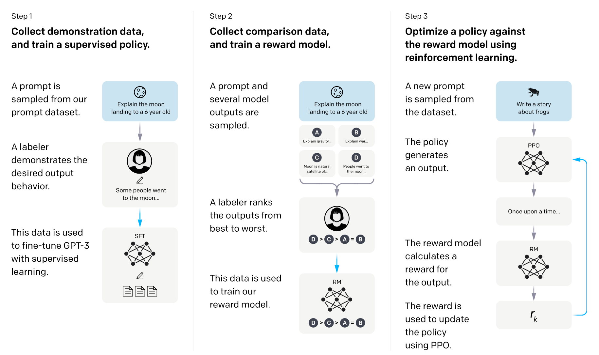

## InstructGPT 的论文 
*Training language models to follow instructions with human feedback*[^1]

GPT = Generative Pre-trained Transformer[^2]

## InstructGPT 方法[^1]

方法分为 3 步：
1. supervised fine-tuning (SFT) 有监督微调
2. reward model (RM) training 奖励模型训练
3. reinforcement learning via proximal policy optimization (PPO) 基于近端策略优化 PPO[^3] 的强化学习  

# 参考资料
[^1]:<a id="ref1"> https://arxiv.org/abs/2203.02155 </a>  
[^2]:<a id="ref2"> https://www.youtube.com/watch?v=e0aKI2GGZNg </a>  
[^3]:<a id="ref3"> https://arxiv.org/abs/1707.06347 </a> 
