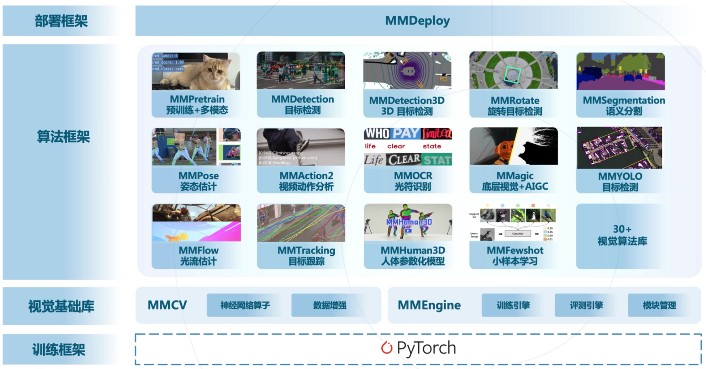

# OpenMMLab

[OpenMMLab](https://github.com/open-mmlab)
基于 PyTorch，涵盖 30+ 个视觉库，实现了 300+ 种算法，并包含 2400+ 个预训练模型[^2]。

## OpenMMLab 包括以下项目

- [MMEngine](https://github.com/open-mmlab/mmengine): OpenMMLab 深度学习模型训练基础库
- [MMCV](https://github.com/open-mmlab/mmcv): OpenMMLab 计算机视觉基础库
- [MIM](https://github.com/open-mmlab/mim): MIM 是 OpenMMlab 项目、算法、模型的统一入口
- [MMEval](https://github.com/open-mmlab/mmeval): 统一开放的跨框架算法评测库
- [MMPreTrain](https://github.com/open-mmlab/mmpretrain): OpenMMLab 深度学习预训练工具箱
- [MMDetection](https://github.com/open-mmlab/mmdetection): OpenMMLab 目标检测工具箱
- [MMDetection3D](https://github.com/open-mmlab/mmdetection3d): OpenMMLab 新一代通用 3D 目标检测平台
- [MMRotate](https://github.com/open-mmlab/mmrotate): OpenMMLab 旋转框检测工具箱与测试基准
- [MMYOLO](https://github.com/open-mmlab/mmyolo): OpenMMLab YOLO 系列工具箱与测试基准
- [MMSegmentation](https://github.com/open-mmlab/mmsegmentation): OpenMMLab 语义分割工具箱
- [MMOCR](https://github.com/open-mmlab/mmocr): OpenMMLab 全流程文字检测识别理解工具包
- [MMPose](https://github.com/open-mmlab/mmpose): OpenMMLab 姿态估计工具箱
- [MMHuman3D](https://github.com/open-mmlab/mmhuman3d): OpenMMLab 人体参数化模型工具箱与测试基准
- [MMSelfSup](https://github.com/open-mmlab/mmselfsup): OpenMMLab 自监督学习工具箱与测试基准
- [MMRazor](https://github.com/open-mmlab/mmrazor): OpenMMLab 模型压缩工具箱与测试基准
- [MMFewShot](https://github.com/open-mmlab/mmfewshot): OpenMMLab 少样本学习工具箱与测试基准
- [MMAction2](https://github.com/open-mmlab/mmaction2): OpenMMLab 新一代视频理解工具箱
- [MMTracking](https://github.com/open-mmlab/mmtracking): OpenMMLab 一体化视频目标感知平台
- [MMFlow](https://github.com/open-mmlab/mmflow): OpenMMLab 光流估计工具箱与测试基准
- [MMagic](https://github.com/open-mmlab/mmagic): OpenMMLab 新一代人工智能内容生成（AIGC）工具箱
- [MMGeneration](https://github.com/open-mmlab/mmgeneration): OpenMMLab 图片视频生成模型工具箱
- [MMDeploy](https://github.com/open-mmlab/mmdeploy): OpenMMLab 模型部署框架
- [Playground](https://github.com/open-mmlab/playground): 收集和展示 OpenMMLab 相关的前沿、有趣的社区项目

<!-- 下面是本次训练营课程讲解的 5 个项目。[^1] -->

## MMPreTrain 
[MMPreTrain](https://github.com/open-mmlab/mmpretrain) 是做图像分类、预训练和多模态的算法库。
提供了77个算法，508个预训练模型。

支持多种开箱即用的推理任务
- 图像分类 (Image Classification)
- 图像描述 (Image Caption)
- 视觉问答 (Visual Question Answering)
- 视觉定位 (Visual Grounding)
- 检索 (Image-To-Image, Text-To-Image, Image-To-Text)

## MMSegmentation
[MMSegmentation](https://github.com/open-mmlab/mmsegmentation) 是专门做图像分割，特别是语义分割的算法库。在街景、无人驾驶、遥感图像和医疗领域等领域语义分割都是非常重要的算法。语义分割最常用的场景就是在医疗影像分析和卫星遥感分析。

MMSegmentation 提供了600多个预训练模型，复现了40多篇论文。同时，也可以用他来训练自己的语义分割算法。

## MMDetection

其中最知名的算法库就是 [MMDetection]([MMDetection](https://github.com/open-mmlab/mmdetection)) 目标检测算法库，在业界有很大影响力，在 github 上有 24k star。

MMDetection 可以解决目标检测，实例分割，全景分割和目标追踪任务，不仅实现了这些领域上的经典算法，还包括前沿顶会论文的复现，例如 Faster R-CNN，RetinaNet，SSD，YOLOv3，RTMDet，DiffusionDet 等。

## MMPose
[MMPose](https://github.com/open-mmlab/mmpose) 是专门做姿态估计的算法库。姿态估计其实就是关键点检测，例如把一个人的关节骨架的点识别出来，然后串成一个火柴人。
MMPose支持人脸，人体手动物和服装的关键点检测，既有2d又有3d。

[人体姿态估计与 MMPose 看这里](./HumanPoseEstimation.md)

## MMagic
[MMagic](https://github.com/open-mmlab/mmediting) 从这个名字我们就能看出来他是一个魔法库 :)。他是人工智能内容生成（AIGC）工具箱。

# 参考资料
[^1]:<a id="OpenMMLabCamp">[OpenMMLabCamp AI 实战营](https://github.com/open-mmlab/OpenMMLabCamp)</a>   
[^2]:<a id="5.31">[Github八万star，开源计算机视觉神器OpenMMLab](https://www.bilibili.com/video/BV1js4y1i72P/?vd_source=86f975c2afd68dc55284d0ebca36382b)</a> 

