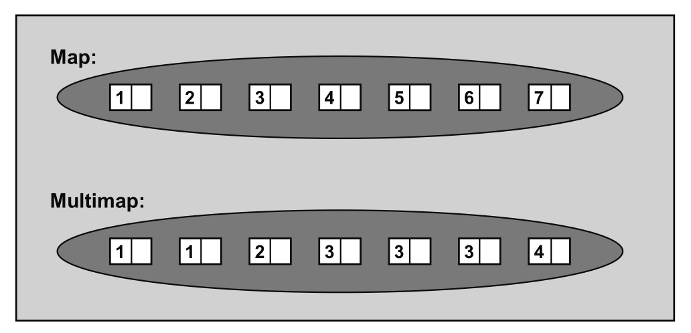

# Maps and Multimaps

Maps 和 multimaps 底层数据结构为红黑树(RB-Tree)，存储的元素为 pair，根据 key 自动对元素进行排序[^1][^2]。他们的区别在于:
- Maps 不允许重复键，插入采用 RB-Tree 的 insert_unique()。
- Multimaps 允许重复键, 插入采用 RB-Tree 的 insert_equal()。



## 遍历 map [^3]

### C++ 11

```C++
// 迭代器
for (map<int, string>::iterator it = m.begin(); it != m.end(); ++it) {
    int key = it->first;
    string& value = it->second;
    cout << key << ": " << value << endl;
}

// range-bases for loop
for (auto& p : m) {
    int key = p.first;
    string& value = p.second;
    cout << key << ": " << value << endl;
}
```
### C++ 17
```C++
// range-based for loops together with structured bindings
for (const auto &[k, v] : m) {
    cout << k << ": " << v << endl;
}
```


# 参考资料
[^1]:*The C++ Standard Library A Tutorial and Reference Second Edition Nicolai M. Josuttis* 
[^2]:*STL源码剖析 侯捷*
[^3]:https://stackoverflow.com/questions/4207346/how-can-i-traverse-iterate-an-stl-map