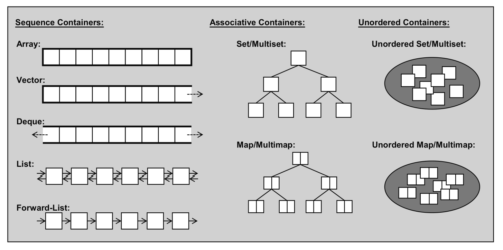

## Table of Contents
- [1. Linux tools](#linux)
- [2. C++](#c++)
    - [2.1 Courses](#courses)
    - [2.2 Books](#books)
    - [2.3 STL](#stl)
- [3. Data structures](#ds)
- [4. Algorithms](#algorithms)
- [5. LeetCode](#leetcode)
    - [5.1 Array](#linkedlist)
    - [5.2 Linked List](#linkedlist)

## 1. Linux tools 
[MIT：The Missing Semester of Your CS Education](https://missing.csail.mit.edu/)

>Lectures:
- [Course overview + the shell](https://missing.csail.mit.edu/2020/course-shell/)
- [Shell Tools and Scripting](https://missing.csail.mit.edu/2020/shell-tools/)
- [Editors (Vim)](https://missing.csail.mit.edu/2020/editors)
- [Data Wrangling](https://missing.csail.mit.edu/2020/data-wrangling)
- [Command-line Environment](https://missing.csail.mit.edu/2020/command-line)
- [Version Control (Git)](https://missing.csail.mit.edu/2020/version-control)
- [Debugging and Profiling](https://missing.csail.mit.edu/2020/debugging-profiling)
- [Metaprogramming](https://missing.csail.mit.edu/2020/metaprogramming)
- [Security and Cryptography](https://missing.csail.mit.edu/2020/security)
- [Potpourri](https://missing.csail.mit.edu/2020/potpourri)
- [Q&amp;A](https://missing.csail.mit.edu/2020/qa)

## 2. C++ 
### 2.1 Courses 
Stanford University [CS 106L: Standard C++ Programming](http://web.stanford.edu/class/cs106l/index.html)

### 2.2 Books 
[The Definitive C++ Book Guide and List](https://stackoverflow.com/questions/388242/the-definitive-c-book-guide-and-list/388282#388282)

### 2.3 STL 

#### 2.3.1 STL containers 

>*The C++ Standard Library A Tutorial and Reference by Nicolai M. Josuttis. Figure 6.2. STL Container Types.*

| Containers | Types | Data structures | Time complexity | Others |
| ---------- | ----- | --------------- | --------------- | ------ |
[vector](https://en.cppreference.com/w/cpp/container/vector) | sequence container | contiguous; dynamic array |1. Random access - constant O(1)   2. Insertion or removal of elements at the end - amortized constant O(1)   3. Insertion or removal of elements - linear in the distance to the end of the vector O(n)  | The storage of the vector is handled automatically, being expanded and contracted as needed.
[deque](https://en.cppreference.com/w/cpp/container/deque)  An abbreviation for “double-ended queue.”| sequence container  | The elements of a deque are not stored contiguously: typical implementations use a sequence of individually allocated fixed-size **arrays**, with additional bookkeeping. | 1. Random access - constant O(1)   2. Insertion or removal of elements at the **end** or **beginning** - constant O(1)   3. Insertion or removal of elements - linear O(n) | The storage of a deque is automatically **expanded** and **contracted** as needed.
[array](https://en.cppreference.com/w/cpp/container/array)|container |static array|Random access - constant O(1)|Have to specify its size at creation time.
[list](https://en.cppreference.com/w/cpp/container/list)|sequence container|a doubly-linked list|1. Access to an arbitrary element takes linear time. 2. Insertion or removal of an element is fast at any position O(1).|Lists do not provide random access.
[forward_list](https://en.cppreference.com/w/cpp/container/forward_list)|sequence container|a singly-linked list|1. Access to an arbitrary element takes linear time. 2. Insertion or removal of an element is fast at any position O(1).|Can’t search for an element and then delete it or insert another element in front of it.
[queue](https://en.cppreference.com/w/cpp/container/queue)|container adaptor|deque(default)|FIFO  O(1)|Can use any sequence container class that provides the member functions front(), back(), push_back(), and pop_front(). 
[priority_queue](https://en.cppreference.com/w/cpp/container/priority_queue)|container adaptor|vector(default)  heap algorithms|logarithmic insertion and extraction|Can use any sequence container class that provides random-access iterators and the member functions front(), push_back(), and pop_back(). e.g., deque.
[stack](https://en.cppreference.com/w/cpp/container/stack)|container adaptor|deque(default)|LIFO O(1)|Unlike vectors, deques free their memory when elements are removed and don’t have to copy all elements on reallocation.
[set](https://en.cppreference.com/w/cpp/container/set)|sorted associative container|[red-black trees](https://en.wikipedia.org/wiki/Red%E2%80%93black_tree)|Search, removal, and insertion operations have logarithmic complexity.|Multisets allow duplicates, whereas sets do not.
[multiset](https://en.cppreference.com/w/cpp/container/multiset)|sorted associative container|[red-black trees](https://en.wikipedia.org/wiki/Red%E2%80%93black_tree)|Search, removal, and insertion operations have logarithmic complexity.|Multisets allow duplicates, whereas sets do not.
[map](https://en.cppreference.com/w/cpp/container/map)|sorted associative container|[red-black trees](https://en.wikipedia.org/wiki/Red%E2%80%93black_tree)|Search, removal, and insertion operations have logarithmic complexity.| Could consider sets and multisets as special maps and multimaps, respectively.
[multimap](https://en.cppreference.com/w/cpp/container/multimap)|sorted associative container|[red-black trees](https://en.wikipedia.org/wiki/Red%E2%80%93black_tree)|Search, removal, and insertion operations have logarithmic complexity.|For multimaps, the order of elements with equivalent keys is random but stable.

## 3. Data structures 

## 4. Algorithms 

## 5. LeetCode 

### 1. [Array](https://leetcode.com/tag/linked-list) 
| # | Title | Solution | Difficulty | Topics |
|---| ----- | -------- | ---------- | ------ |

| 27 | [Remove Element](https://leetcode.com/problems/remove-element/) | [C++](./leetcode/array/lc27.cpp) | easy | [array](https://leetcode.com/tag/array/) |

| 283 | [Move Zeroes](https://leetcode.com/problems/move-zeroes/) | [C++](./leetcode/array/lc283.cpp) | easy | [Array](https://leetcode.com/tag/array/) |

<!--
|  |  | [C++](./leetcode/array/) |  | [array](https://leetcode.com/tag/array/) |
-->

### 2. [Linked List](https://leetcode.com/tag/linked-list) 
| # | Title | Solution | Difficulty | Topics |
|---| ----- | -------- | ---------- | ------ |
| 2 | [Add Two Numbers](https://leetcode.com/problems/add-two-numbers/) | [C++](./leetcode/list/lc2.cpp) | Medium | [Linked List](https://leetcode.com/tag/linked-list) |

<!--
|  |  | [C++](./leetcode/list/) |  | [Linked List](https://leetcode.com/tag/linked-list) |
-->

