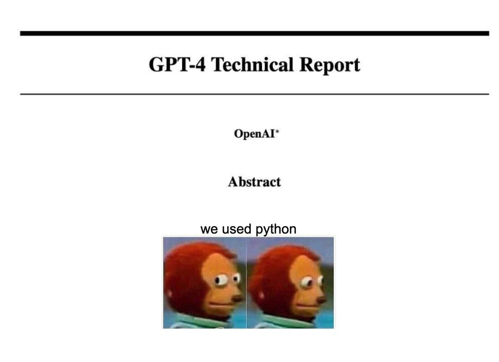

# 前言

按照[费曼学习法](methodology/Feynman_Technique.md)的理论，学习要有输出。计算机知识很多很杂，要落实到代码上，亲自动手，才能真正学会。

因此，在学习的过程中，知识点落实到代码上，落实到文字总结上。这就是创建这个项目的初衷，记录总结回顾。

[专注于学习和创造，而不是娱乐和分心](./methodology/Focus_On_Learning_and_Creating.md)

# C++
## 面向对象编程 OOP(Object Oriented Programming)

### C++ 面向对象三大特性
1. Encapsulation - 封装 
2. Inheritance - 继承
3. Polymorphism - 多态

<!-- ### 虚函数

## 智能指针

## 右值引用，移动语义，完美转发 -->

# 算法
一些常见的算法，比如排序。

## 排序算法 
[十大排序算法详解](sort/sort.md)  
[源代码](sort/src)
| 算法名称 | 平均时间复杂度 | 最好情况     | 最坏情况   | 空间复杂度 | 排序方式  | 稳定性 |
| :------- | :------------- | :----------- | :--------- | :--------- | :-------- | :----- |
| 冒泡排序 | $O(n^2)$       | $O(n)$       | $O(n^2)$   | $O(1)$     | In-place  | 稳定   |
| 选择排序 | $O(n^2)$       | $O(n^2)$     | $O(n^2)$   | $O(1)$     | In-place  | 不稳定 |
| 插入排序 | $O(n^2)$       | $O(n)$       | $O(n^2)$   | $O(1)$     | In-place  | 稳定   |
| 快速排序 | $O(nlogn)$     | $O(nlogn)$   | $O(n^2)$   | $O(logn)$  | In-place  | 不稳定 |
| 归并排序 | $O(nlogn)$     | $O(nlogn)$   | $O(nlogn)$ | $O(n)$     | Out-place | 稳定   |
| 堆排序   | $O(nlogn)$     | $O(nlogn)$   | $O(nlogn)$ | $O(1)$     | In-place  | 不稳定 |
| 希尔排序 | $O(nlogn)$     | $O(nlog^2n)$ | $O(n^2)$   | $O(1)$     | In-place  | 不稳定 |
| 计数排序 | $O(n+k)$       | $O(n+k)$     | $O(n+k)$   | $O(k)$     | Out-place | 稳定   |
| 桶排序   | $O(n+k)$       | $O(n+k)$     | $O(n^2)$   | $O(n+k)$   | Out-place | 稳定   |
| 基数排序 | $O(n*k)$       | $O(nk)$      | $O(nk)$    | $O(n+k)$   | Out-place | 稳定   |

注：
- In-place: 不需要额外的空间,原地修改序列实现算法。其空间复杂度为 $O(1)$。
- Out-place: 需要额外的空间来实现算法。其空间复杂度一般为O($n)$或O($k)$等。
- 稳定性：稳定的排序算法会保持相同元素的相对位置不变。

通常会把它们分为三类[^1]：
1. 冒泡排序、选择排序、插入排序
2. 堆排序、归并排序、快速排序
3. 计数排序、基数排序 、桶排序

前两类是基于比较的排序算法。对n个元素进行排序时， 若元素比较大小的时间复杂度为 $O(1)$，则第一类排序算法的时间复杂度为 $O(n^2)$，第一类排序算法的时间复杂度为 $O(nlogn)$。实际上，基于比较的排序算法的时间复杂度下 界为 $O(nlogn)$。  
第三类不直接比较大小，而是对被排序的数值采取按位划分、分类映射等处理方式。其时间复杂度不仅与 n 有关，还与数值的大小范围 m 有关。 

### STL 中的 sort 函数
我们在写代码的时候是用标准库的，那么在 STL 中的排序算法是如何实现的，让我们来一探究竟：[STL 中的 sort 函数详解。](./sort/stlsort.md)

<!-- ###  parallel sort 并行/多线程排序 -->

# AI
## ChatGPT
ChatGPT-3.5/4 火的不得了，引爆整个网络，推上每天都在讨论他，各种基于 ChatGPT 的应用层出不穷，GitHub上相关的项目更是爆发增长，新出一个开源项目很快就能拿到几k几十k的star，有一个比较有意思的项目是训练自己的私人助手([privateGPT](https://github.com/imartinez/privateGPT))，用自己的资料去训练。我尝试了一下对显卡和内存的要求比较高，速度很慢。对于程序员来说，最大的应用就是让他帮我们写代码了。在学习过程中，看不懂的代码直接丢给他，很快就生成详细的解答。

OpenAI 目前没有公布 ChatGPT 的论文，不过[官网博客](https://openai.com/blog/chatgpt)有说和  InstructGPT 吧。
>We trained this model using Reinforcement Learning from Human Feedback (RLHF), using the same methods as InstructGPT, but with slight differences in the data collection setup.

InstructGPT 论文看这里：[InstructGPT 原理](AI/instructGPT.md)
GPT 论文看这里：[GPT 1-3](AI/GPT123.md)

| Models      | Parameters |    Supported |    Date | References |               Papers |
| :---------- | ---------: | -----------: | ------: | ---------: | -------------------: |
| GPT-1       |            |         Text | 06/2018 |       5.5k |            Paper[^2] |
| GPT-2       |            | Text & Image | 02/2019 |         6k |            Paper[^3] |
| GPT-3       |       175B |         Text | 05/2020 |        10k |            Paper[^4] |
| InstructGPT |       1.3B |         Text | 03/2022 |        923 |            Paper[^5] |
| GPT-4       |       100T | Text & Image | 05/2023 |         16 | Technical Report[^6] |

By the way :)
  
<a href="https://twitter.com/_willfalcon/status/1635712178031296520?lang=en">@_willfalcon</a>

  
W
## 计算机视觉 computer vision 
[通用视觉框架 OpenMMLab](./AI/openmmlab.md)

[人体姿态估计 (Human Pose Estimation)](./AI/HumanPoseEstimation.md)
[RTMPose 关键点检测](./AI/RTMPose.md)

# 刷题
这里记录刷过的算法题。

[LeetCode Top 100 Liked Questions](https://leetcode.com/problem-list/top-100-liked-questions/)

| #   | Title                                                | Solution                        | Difficulty | Topics            | Others |
| --- | ---------------------------------------------------- | ------------------------------- | ---------- | ----------------- | ------ |
| 1   | [1. Two Sum](https://leetcode.com/problems/two-sum/) | [C++](./leetcode/array/lc1.cpp) | Easy       | Array, Hash Table |

# 参考资料
[^1]:<a id="ref1">《算法竞赛进阶指南》李煜东</a>  
[^2]:<a id="GPT-1"> [Improving Language Understanding by Generative Pre-Training](https://cdn.openai.com/research-covers/language-unsupervised/language_understanding_paper.pdf) </a>  
[^3]:<a id="GPT-2"> [Language Models are Unsupervised Multitask Learners](https://cdn.openai.com/better-language-models/language_models_are_unsupervised_multitask_learners.pdf) </a>   
[^4]:<a id="GPT-3"> [Language Models are Few-Shot Learners](https://arxiv.org/abs/2005.14165) </a>  
[^5]:<a id="InstructGPT"> [Training language models to follow instructions with human feedback](https://arxiv.org/abs/2203.02155) </a>  
[^6]:<a id="GPT-4"> [GPT-4 Technical Report](https://arxiv.org/abs/2303.08774) </a>

<!-- 1. 《算法笔记》 胡凡
1. *C++ Primer (5th Edition)*
2. *Effective Modern C++* -->

