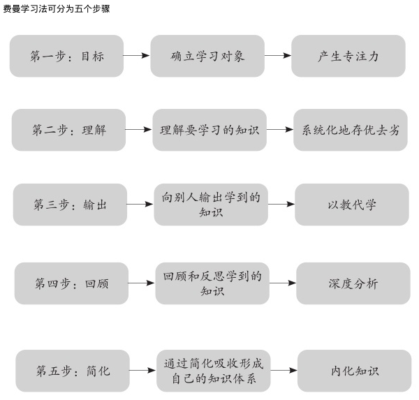

## 费曼学习法 
[@huihoo](https://twitter.com/huihoo/status/1507549694662430724?s=20)

费曼学习法(Feynman Technique)是地表最强学习方法。

费曼学习法可以简化为四个单词：
1. Concept（概念）
2. Teach（教给别人）
3. Review（回顾评价）
4. Simplify（简化）

可在这个基础上，整理为五个步骤：确立目标，理解目标，输出，回顾，简化。

