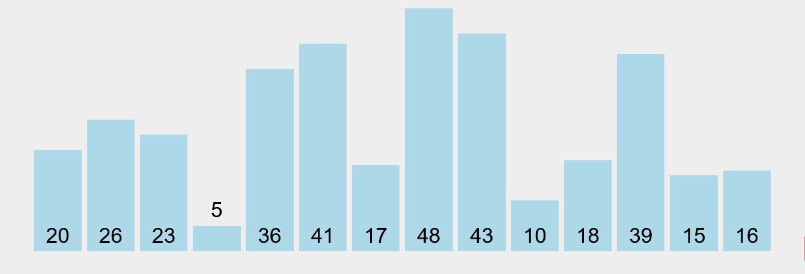
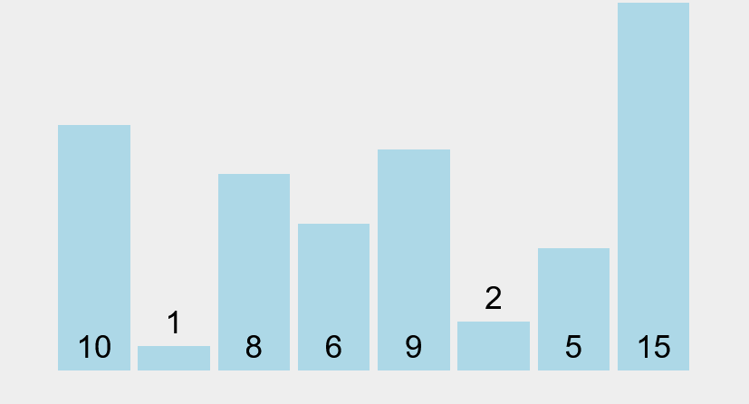
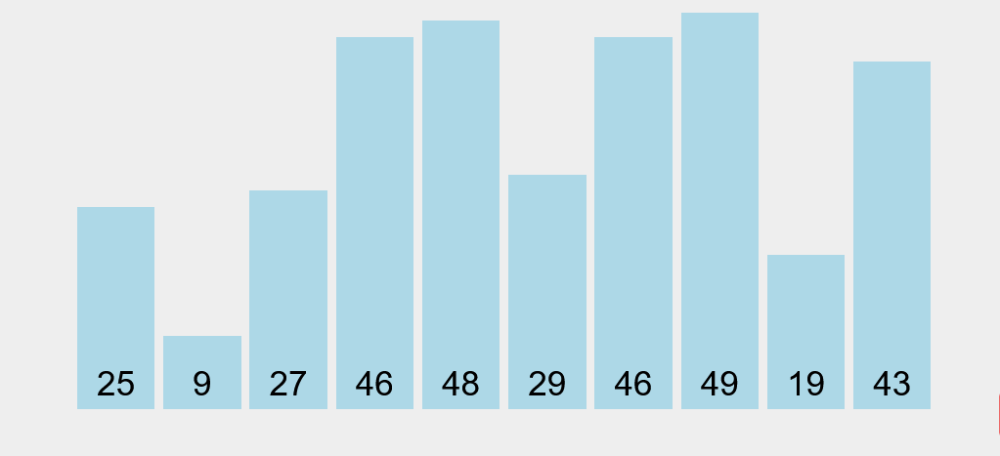
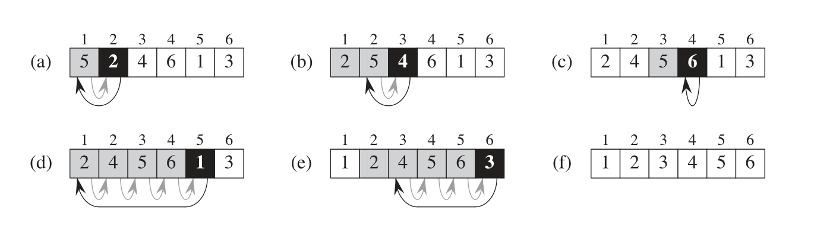
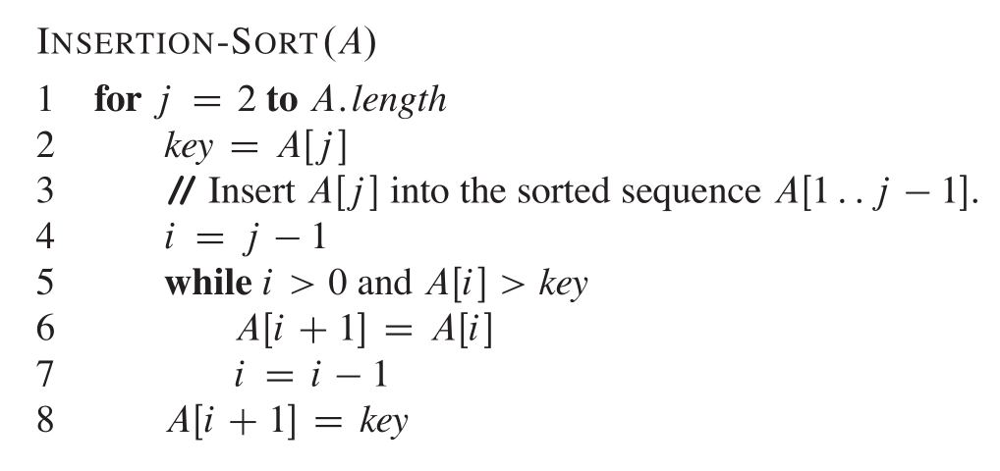

# 十大排序算法

## 冒泡排序

图示[^1]


冒泡排序是一种简单的排序算法，其时间复杂度为O(n^2)。该算法由n轮组成，在每一轮中，它遍历数组中的元素。每当找到两个相邻的元素处于错误的顺序时，算法会交换它们。该算法可以如下实现[^2]：

```c++
for (int i = 0; i < n; i++) {
    for (int j = 0; j < n-1; j++) {
        if (array[j] > array[j+1]) {
            swap(array[j],array[j+1]);
        }
    }
}
```
在第一轮冒泡排序之后，最大的元素将处于正确的位置，更一般地，经过k轮冒泡排序后，k个最大的元素将处于正确的位置。因此，经过n轮冒泡排序后，整个数组将被排序。

简单来说，冒泡排序就是两两比较，每一轮将(未排序序列)最大值移到(未排序序列)最右边。可优化的地方是如果一轮比较下来没有交换元素，就说明已经排序完成，可以提前终止。

## 选择排序

图示[^1]


选择排序的基本思想是:
1. 在未排序区间中选出最小(或最大)元素
2. 将其与未排序区间的起始元素交换
3. 重复步骤 1 和 2,直到未排序区间为空

选择排序有两个很鲜明的特点[^4]:

1. **运行时间和输入无关。** 为了找出最小的元素每轮都要扫描一遍数组。所以最好情况也是O($n^2$)

2. **数据移动是最少的。** 每次交换都会改变两个数组元素的值，因此选择排序用了 N 次交换——交换次数和数组的大小是线性关系。


选择排序是不稳定的，例如数组[6,6,2]，第一次交换就会改变两个6的顺序。


## 插入排序

图示[^1]

<!-- <video src="../images/insertion_sort.mp4" width="320" height="240" controls></video> -->

插入排序的基本思想是:
1. 将数组分为已排序区间和未排序区间
2. 从未排序区间中取出第一个元素
3. 在已排序区间中找到合适的插入位置将其插入
4. 重复步骤 2 和 3,直到未排序区间为空

下图[^3]是选择排序步骤。每轮完成一个元素的排序，寻找到合适的位置并插入。比较的过程中，已排序的元素依次往后挪一个位置。


伪代码[^3], A[i]表示数组 A 的第 i 个元素。



# 参考资料
[^1]:<a id="ref1"> https://visualgo.net/en </a>  
[^2]:<a id="ref1"> *Guide to Competitive Programming: Learning and Improving Algorithms Through Contests Second Edition by Antti Laaksonen*</a>  
[^3]:<a id="ref1"> 《算法导论》第三版 </a>  
[^4]:<a id="ref1"> 《算法》第四版 </a>  

